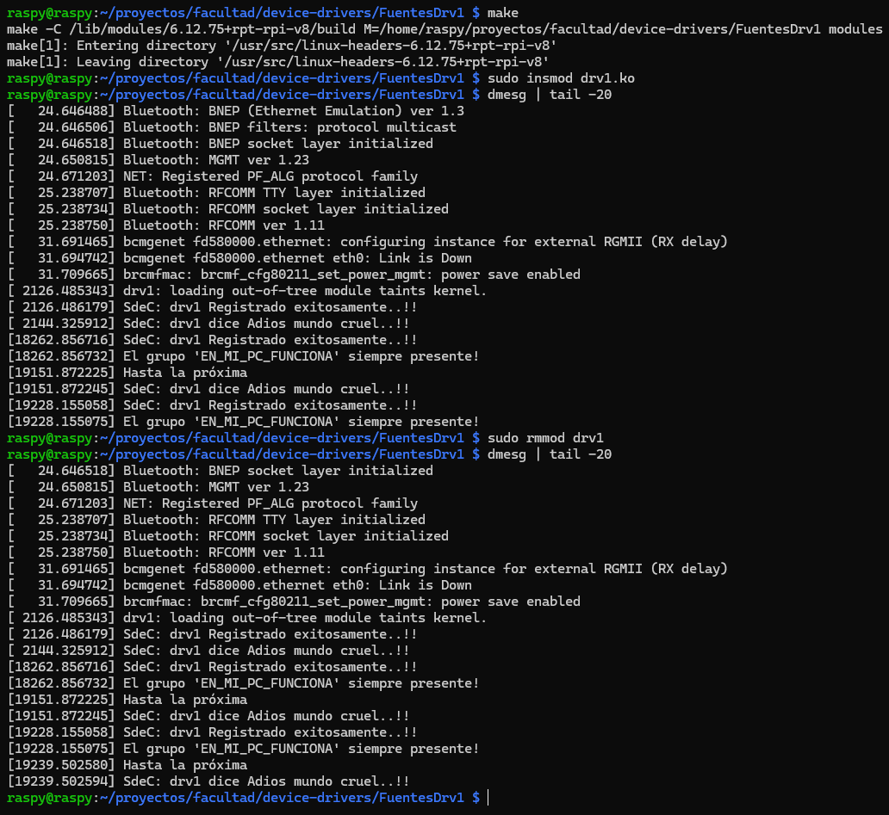

# TP5 - Device drivers

## Integrantes
- Antonino, Tadeo - tadeo.antonino@mi.unc.edu.ar
- Fioramonti, Martino - martino.fioramonti@mi.unc.edu.ar
- Quintana, Ignacio Agustin - ignacio.agustin.quintana@mi.unc.edu.ar

---

## Repositorio GitHub

https://github.com/IgnacioQuintana57/EN_MI_PC_FUNCIONA

---

## Introducción

## Desarrollo

### Materiales utilizados

Para realizar este trabajo hicimos uso de una raspberry Pi 4 Unit y un Arduino UNO. En la raspy fue donde montamos el drivre que debiamos crear y donde hosteamos nuestro "Server" que leia eso. El arduino fue utilizado para generar 2 señales cuadradas, una de periodo de 1s y otra de 0.5s. Dichas señales las conectamos a la raspy.
En la raspy no teniamos instalado el SO, por lo que lo instalamos nuevamente y habilitamos desde el principio la conexion por SSH. En nuestro caso nuestra rasp se encontraba en 192.168.1.135 con el puerto por defecto (22).
Lo primero que hicimos fue conectarnos desde otra PC para ver si funcionaba la conexion.

### Conexión del Hardware

D8 arduino => Señal cuadrada de 1s => Divisor (arduino 5v => raspy 3,3v aprox) => pin fisico raspy (11) => GPIO17
D9 arduino => Señal cuadrada de 0,5 => Divisor => pin fisico raspy (13) => GPIO27

[Imagen de lo montado]

### Pruebas iniciales

Antes de largarnos a realizar el driver y todo lo demas, queriamos validar el funcionamiento de la conexcion que habiamos realizado. Sobre todo porque nunca habiamos trbajado con los puertos GPIO de una raspberry pi y no sabiamos si estaba todo conectado. Para ello hicimos uso de algunos comandos de linux para leer directamente los valores de entrada de los pines GPIO utilizados.
Con ello validamos que la conexion era correcta y que las raspy leia correctamente la señal proveniente del Arduino UNO

Luego pasamos a reutilizar los driver ya creados dados por la catedra. (https://gitlab.com/sistemas-de-computacion-unc/device-drivers/).

Primero hicimos una prueba sencilla sin complicaciones de cross-compilation. Enviamos el zip completo del repositorio a la raspy, agregamos en el drv1 nuestro nombre de grupo e hicimos el make ahi mismo.

Luego ejecutamos el mismo drv1, pero para probar la compilación cruzada. Para ello hicimos uso del WSL de una de nuestras computadoras con Windows.
Los datos de nuestra Raspberry Pi eran: 
- **Modelo:** Raspberry Pi 400
- **Kernel:** 6.12.75+rpt-rpi-v8
- **Arquitectura:** aarch64 / arm64