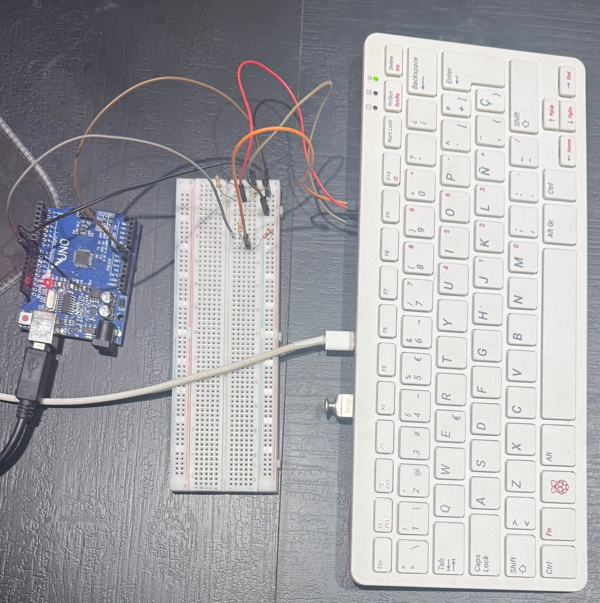
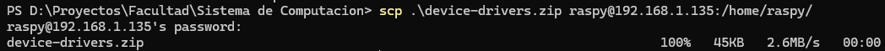
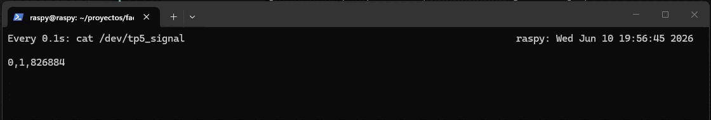
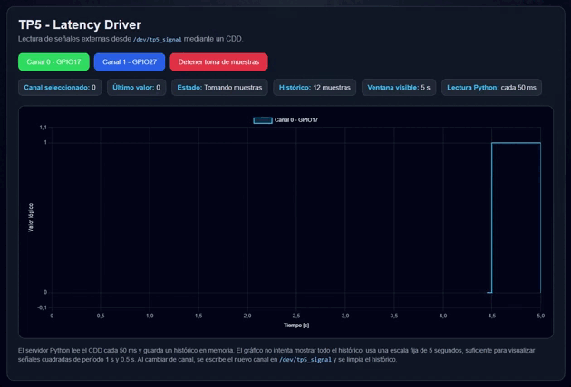

# TP5 - Device drivers

## Integrantes
- Antonino, Tadeo - tadeo.antonino@mi.unc.edu.ar
- Fioramonti, Martino - martino.fioramonti@mi.unc.edu.ar
- Quintana, Ignacio Agustin - ignacio.agustin.quintana@mi.unc.edu.ar

---

## Repositorio GitHub

https://github.com/IgnacioQuintana57/EN_MI_PC_FUNCIONA

---

## Introducción

En este trabajo práctico desarrollamos un sistema completo para leer señales externas desde una Raspberry Pi mediante un **Character Device Driver (CDD)** en Linux.

La idea central fue conectar dos señales cuadradas generadas por un Arduino UNO a dos pines GPIO de la Raspberry, implementar un driver que tome esas lecturas desde espacio de kernel y exponerlas hacia una aplicación de usuario mediante un archivo de dispositivo en `/dev`.

Además del driver, desarrollamos una aplicación web en Python que permite seleccionar qué canal leer y graficar la señal en función del tiempo. De esta forma, el trabajo no quedó solamente en cargar un módulo de kernel, sino que también incluyó la validación del hardware, la comunicación entre kernel-space y user-space, y una interfaz de visualización para observar las mediciones.

El desarrollo se realizó sobre una Raspberry Pi 400, utilizando los ejemplos de drivers provistos por la cátedra como punto de partida conceptual, especialmente para entender cómo se registra un dispositivo de caracteres y cómo se conectan las operaciones `open()`, `read()`, `write()` y `close()` con las funciones implementadas por el módulo.

## Objetivo del trabajo

El objetivo del TP fue diseñar e implementar un **driver de caracteres** capaz de sensar dos señales externas y permitir que una aplicación de usuario lea una de ellas.

Para cumplirlo, el sistema debía resolver cuatro puntos principales:

- leer dos entradas GPIO conectadas a señales externas;
- exponer la lectura mediante un archivo de dispositivo en `/dev`;
- permitir que la aplicación de usuario seleccione qué canal quiere leer;
- graficar la señal seleccionada en función del tiempo.

En nuestro caso, las señales externas fueron generadas con un Arduino UNO. La Raspberry Pi recibió esas señales en los GPIO 17 y 27, y el driver expuso la información mediante el archivo:

```text
/dev/tp5_signal
```

La aplicación de usuario leyó ese archivo periódicamente y mostró los valores en una interfaz web.

## Desarrollo

### Materiales utilizados

Para realizar el trabajo usamos una **Raspberry Pi 400** y un **Arduino UNO**. La Raspberry fue el equipo donde cargamos el módulo de kernel y donde ejecutamos la aplicación de usuario. El Arduino se utilizó como generador de señales externas, porque nos permitía producir dos señales digitales simples y controladas sin depender de sensores adicionales.

Los elementos principales utilizados fueron:

- Raspberry Pi 400 Rev 1.1.
- Arduino UNO.
- Dos salidas digitales del Arduino: D8 y D9.
- Dos entradas GPIO de la Raspberry: GPIO17 y GPIO27.
- Divisores resistivos para adaptar los niveles de tensión.
- Conexión SSH para trabajar sobre la Raspberry desde otra computadora.

Antes de comenzar con el driver, instalamos el sistema operativo en la Raspberry y habilitamos el acceso por SSH. En nuestras pruebas, la Raspberry quedó accesible en la dirección `192.168.1.135`, usando el puerto por defecto `22`.

### Conexión del hardware

El Arduino UNO genera señales digitales de 5 V, mientras que los pines GPIO de la Raspberry trabajan con lógica de 3.3 V. Por ese motivo, no conectamos las salidas del Arduino directamente a la Raspberry, sino que usamos un divisor resistivo para reducir la tensión y evitar dañar los GPIO.

La conexión utilizada fue la siguiente:

| Señal | Salida Arduino | Entrada Raspberry | Pin físico Raspberry | Descripción |
|---|---:|---:|---:|---|
| Canal 0 | D8 | GPIO17 | 11 | Señal cuadrada de período aproximado 1 s |
| Canal 1 | D9 | GPIO27 | 13 | Señal cuadrada de período aproximado 0.5 s |

Además, ambas placas compartieron una referencia común de tierra mediante la conexión entre los pines **GND** del Arduino y la Raspberry. Esto es necesario para que la Raspberry pueda interpretar correctamente los niveles lógicos provenientes del Arduino.

```text
Arduino D8  -> divisor resistivo -> Raspberry GPIO17, pin físico 11
Arduino D9  -> divisor resistivo -> Raspberry GPIO27, pin físico 13
Arduino GND -> Raspberry GND
```

Como referencia para ubicar los pines, usamos el siguiente esquema general de GPIO de Raspberry Pi. Aunque no corresponde exactamente al modelo físico utilizado, sirve para identificar la posición de GPIO17, GPIO27 y GND en el conector.


El montaje físico realizado para el TP quedó conectado de la siguiente manera:



### Pruebas iniciales

Antes de comenzar con el desarrollo del driver, hicimos una validación básica del hardware. La prioridad en esta etapa fue comprobar que la Raspberry estuviera recibiendo correctamente las señales generadas por el Arduino. Esto era importante porque, si la lectura de GPIO fallaba, no tenía sentido avanzar todavía con el módulo de kernel.

Primero verificamos que la conexión por SSH funcionara correctamente. Esto nos permitió trabajar desde otra computadora, copiar archivos a la Raspberry y ejecutar comandos directamente sobre el sistema donde se iba a cargar el driver.

Luego revisamos el estado de los GPIO conectados a las salidas del Arduino. Para eso usamos comandos de Linux disponibles en la Raspberry, leyendo los pines GPIO17 y GPIO27 mientras el Arduino generaba las señales cuadradas.

```bash
watch -n 0.2 "pinctrl get 17; pinctrl get 27"
```

Con esta prueba pudimos comprobar que los valores de entrada cambiaban en el tiempo, lo que indicaba que el cableado, la referencia de GND y los divisores resistivos estaban funcionando correctamente. Esta validación previa nos evitó mezclar dos problemas distintos: por un lado el hardware, y por otro lado la implementación del driver.

Después de validar el hardware, pasamos a trabajar con los ejemplos de drivers provistos por la cátedra. El objetivo no era usarlos como entrega final, sino entender el flujo completo: copiar el código a la Raspberry, compilar un módulo, cargarlo en el kernel y verificar su salida mediante los comandos del sistema.

Para eso copiamos el repositorio de ejemplos a la Raspberry:



Como primera prueba, modificamos el ejemplo `drv1` para incluir el nombre del grupo, lo compilamos directamente en la Raspberry y verificamos que se generara el archivo `.ko` correspondiente.

```bash
make
```


Esta prueba nos sirvió para confirmar que el entorno de compilación en la Raspberry estaba funcionando y que podíamos cargar módulos simples antes de pasar a nuestro propio driver. La parte de compilación cruzada la dejamos separada para analizarla al final del informe, ya que requiere una verificación específica del entorno del host, la arquitectura y los headers del kernel.

### Creación del driver `latencyDriver`

Una vez validadas las señales externas y probado el flujo básico de módulos de la cátedra, comenzamos con nuestro propio driver. Lo llamamos `latencyDriver` y lo implementamos como un **Character Device Driver**, siguiendo la misma idea general del ejemplo `drv4`: registrar un dispositivo de caracteres y asociar operaciones de archivo a funciones propias del módulo.

El driver expone un archivo especial en `/dev`:

```c
#define DEVICE_NAME "tp5_signal"
#define CLASS_NAME  "tp5_class"
```

Con eso, al cargar el módulo, el sistema crea el dispositivo:

```text
/dev/tp5_signal
```

La decisión de usar un archivo de dispositivo es importante porque respeta el modelo clásico de Unix/Linux: desde espacio de usuario, un dispositivo puede manipularse como si fuera un archivo. En nuestro caso, la aplicación puede leer datos con `read()` y seleccionar el canal escribiendo sobre el mismo archivo con `write()`.

#### GPIO utilizados

El driver trabaja sobre dos entradas GPIO de la Raspberry:

```c
#define GPIO_SIGNAL_0 17
#define GPIO_SIGNAL_1 27
```

Estos GPIO corresponden a las señales generadas por el Arduino:

- Canal 0: Arduino D8 hacia Raspberry GPIO17.
- Canal 1: Arduino D9 hacia Raspberry GPIO27.

En lugar de depender de una API externa de GPIO, el driver accede directamente a los registros del controlador GPIO del BCM2711, utilizado por Raspberry Pi 4 y Raspberry Pi 400.

```c
#define GPIO_BASE_PHYS 0xFE200000
#define GPIO_SIZE      0x100

#define GPFSEL0_OFFSET 0x00
#define GPLEV0_OFFSET  0x34
```

El mapeo de memoria se realiza durante la inicialización del módulo:

```c
gpio_base = ioremap(GPIO_BASE_PHYS, GPIO_SIZE);
if (!gpio_base) {
    printk(KERN_ERR "tp5_signal: no se pudo mapear GPIO_BASE 0x%X
", GPIO_BASE_PHYS);
    return -ENOMEM;
}
```

Esto permite acceder desde kernel-space a los registros físicos del periférico GPIO. Para liberar correctamente ese recurso, al descargar el módulo se llama a `iounmap()`.

#### Configuración y lectura de GPIO

Antes de leer los pines, el driver los configura como entradas. En los registros `GPFSEL`, cada GPIO ocupa tres bits y el valor `000` indica modo entrada.

```c
static void tp5_gpio_set_input(unsigned int gpio)
{
    unsigned int reg_offset;
    unsigned int shift;
    u32 value;

    reg_offset = GPFSEL0_OFFSET + ((gpio / 10) * 4);
    shift = (gpio % 10) * 3;

    value = ioread32(gpio_reg(reg_offset));
    value &= ~(0x7 << shift);
    iowrite32(value, gpio_reg(reg_offset));
}
```

La lectura del valor lógico se hace desde `GPLEV0`. Como GPIO17 y GPIO27 están entre GPIO0 y GPIO31, ambos pueden leerse desde ese mismo registro.

```c
static int tp5_gpio_read(unsigned int gpio)
{
    u32 level;

    level = ioread32(gpio_reg(GPLEV0_OFFSET));
    return !!(level & BIT(gpio));
}
```

La expresión `BIT(gpio)` arma una máscara para consultar únicamente el bit correspondiente al GPIO solicitado. El resultado se normaliza con `!!` para devolver `0` o `1`.

#### Muestreo periódico

Para tomar muestras en forma periódica, el driver usa un timer del kernel:

```c
static struct timer_list sample_timer;
```

La función asociada al timer lee ambas señales y guarda el último valor de cada canal:

```c
static void sample_timer_callback(struct timer_list *timer)
{
    last_signal_0 = tp5_gpio_read(GPIO_SIGNAL_0);
    last_signal_1 = tp5_gpio_read(GPIO_SIGNAL_1);
    last_sample_ms = ktime_to_ms(ktime_get_boottime());

    mod_timer(&sample_timer, jiffies + msecs_to_jiffies(SAMPLE_PERIOD_MS));
}
```

En el código, el período quedó centralizado en esta constante:

```c
#define SAMPLE_PERIOD_MS 100
```

Durante las pruebas usamos este valor para tener una visualización más fluida en la aplicación web. Si se quisiera dejar el muestreo estrictamente en 1 segundo, bastaría con cambiar la constante a `1000`.

#### Interfaz `read()` y `write()`

El driver define una estructura `file_operations`, que conecta las operaciones realizadas desde user-space con las funciones implementadas en el módulo:

```c
static struct file_operations tp5_fops =
{
    .owner = THIS_MODULE,
    .open = my_open,
    .release = my_close,
    .read = my_read,
    .write = my_write
};
```

Esta estructura es la relación principal entre el archivo `/dev/tp5_signal` y nuestro código. Cuando desde consola ejecutamos `cat /dev/tp5_signal`, el kernel termina invocando la función `my_read()`. Cuando ejecutamos `echo 1 > /dev/tp5_signal`, el kernel termina invocando `my_write()`.

En otras palabras, la aplicación de usuario no llama directamente a funciones del módulo. La aplicación opera sobre un archivo especial y el kernel traduce esas operaciones de archivo a callbacks definidos por el driver.

##### Lectura con `read()`

La función `my_read()` no lee físicamente el GPIO en ese momento. Esa tarea ya la realiza el timer de kernel, que actualiza periódicamente `last_signal_0`, `last_signal_1` y `last_sample_ms`. Lo que hace `read()` es devolver la última muestra disponible del canal seleccionado.

Primero se decide qué valor devolver según la variable global `selected_signal`:

```c
if (selected_signal == 0)
    value = last_signal_0;
else
    value = last_signal_1;
```

Luego se arma una línea de texto en formato CSV dentro de un buffer del kernel:

```c
n = scnprintf(
    kbuf,
    sizeof(kbuf),
    "%d,%d,%llu\n",
    selected_signal,
    value,
    (unsigned long long)last_sample_ms
);
```

El formato elegido fue:

```text
canal,valor,timestamp_ms
```

Por ejemplo:

```text
0,1,123456
```

Esto significa:

- `0`: canal seleccionado;
- `1`: valor lógico leído;
- `123456`: timestamp interno de la última muestra, en milisegundos.

Finalmente, el driver copia esa información hacia user-space usando:

```c
return simple_read_from_buffer(buf, len, off, kbuf, n);
```

Usamos `simple_read_from_buffer()` porque simplifica una tarea típica en drivers de caracteres: copiar datos desde un buffer del kernel hacia el buffer del proceso de usuario respetando `len` y `off`. Esto es importante porque `read()` puede ser llamado más de una vez sobre el mismo archivo, y el offset permite indicar cuándo ya no quedan más datos para leer.

##### Escritura con `write()`

La función `my_write()` se usa para cambiar el canal seleccionado. En vez de crear dos dispositivos distintos, uno para cada señal, decidimos usar el mismo archivo `/dev/tp5_signal` y seleccionar el canal escribiendo `0` o `1`.

Desde user-space, el uso es:

```bash
echo 0 > /dev/tp5_signal
echo 1 > /dev/tp5_signal
```

Dentro del driver, primero se copia el dato recibido desde user-space hacia un buffer del kernel:

```c
if (copy_from_user(kbuf, buf, len) != 0)
    return -EFAULT;

kbuf[len] = '\0';
```

Esto es necesario porque el kernel no debe acceder directamente a memoria de usuario como si fuera memoria propia. La función `copy_from_user()` realiza esa transferencia de forma controlada y permite detectar errores de acceso.

Después se interpreta el primer carácter recibido:

```c
if (kbuf[0] == '0') {
    selected_signal = 0;
    printk(KERN_INFO "tp5_signal: seleccionada señal 0 GPIO%d\n", GPIO_SIGNAL_0);
} else if (kbuf[0] == '1') {
    selected_signal = 1;
    printk(KERN_INFO "tp5_signal: seleccionada señal 1 GPIO%d\n", GPIO_SIGNAL_1);
} else {
    printk(KERN_WARNING "tp5_signal: valor inválido. Use 0 o 1.\n");
    return -EINVAL;
}
```

Si el usuario escribe `0`, el próximo `read()` devuelve el último valor registrado para GPIO17. Si escribe `1`, devuelve el último valor registrado para GPIO27. Si escribe otro valor, el driver responde con `-EINVAL`, indicando que el argumento recibido no es válido.

Esta separación nos pareció importante: el timer mide ambas señales de forma periódica, `write()` solo cambia cuál de esas señales queda seleccionada, y `read()` entrega la última muestra del canal activo. Así evitamos que la lectura desde la aplicación controle directamente el muestreo físico del hardware.

#### Carga y prueba del módulo

Con el driver implementado, lo compilamos para generar el archivo `.ko`:

```bash
make
```

Luego cargamos el módulo en el kernel:

```bash
sudo insmod latencyDriver.ko
```

Para verificar que el módulo estuviera cargado y revisar los mensajes emitidos con `printk`, usamos:

```bash
lsmod | grep -i latency
dmesg | tail -50
```

`lsmod` permite confirmar que el módulo está presente en el kernel, mientras que `dmesg` muestra los mensajes del log del kernel. Esto fue útil para revisar si el driver inicializó correctamente los GPIO, creó el dispositivo y quedó listo para recibir operaciones `read()` y `write()`.

También verificamos la creación del archivo de dispositivo:

```bash
ls -l /dev/tp5_signal
```

Para facilitar las pruebas manuales, dimos permisos de lectura y escritura al dispositivo:

```bash
sudo chmod 666 /dev/tp5_signal
```

Después probamos la lectura y el cambio de canal desde consola:

```bash
cat /dev/tp5_signal

echo 1 > /dev/tp5_signal
cat /dev/tp5_signal

echo 0 > /dev/tp5_signal
cat /dev/tp5_signal
```

Para observar los cambios en vivo usamos:

```bash
watch -n 0.5 "cat /dev/tp5_signal"
```

El resultado fue que el archivo `/dev/tp5_signal` devolvía la última muestra disponible del canal seleccionado, y al escribir `0` o `1` se cambiaba la señal leída por la aplicación.



Finalmente, para descargar el módulo del kernel usamos:

```bash
sudo rmmod latencyDriver
```

Al descargarse, el driver detiene el timer, destruye el dispositivo creado, libera el número de dispositivo y desmapea la región GPIO previamente mapeada.


### Aplicación web de usuario

Una vez que el driver ya exponía las mediciones mediante `/dev/tp5_signal`, desarrollamos una aplicación de usuario en Python para leer ese archivo y mostrar la señal en una interfaz web.

La idea fue mantener la aplicación simple y sin dependencias pesadas. Por eso usamos `http.server`, incluido en la biblioteca estándar de Python, y dejamos el gráfico del lado del navegador usando Chart.js.

Al inicio del script se definen los parámetros principales:

```python
DEV_PATH = "/dev/tp5_signal"
HOST = "0.0.0.0"
PORT = 5000

POLL_INTERVAL_SECONDS = 0.050
DISPLAY_WINDOW_SECONDS = 5
MAX_HISTORY_SECONDS = 60
```

`DEV_PATH` apunta al archivo de dispositivo creado por el driver. La aplicación no accede directamente a los GPIO: solamente lee y escribe sobre `/dev/tp5_signal`, respetando la interfaz definida por el CDD.

#### Lectura del driver desde Python

La función encargada de leer el driver es `read_driver()`:

```python
def read_driver():
    with open(DEV_PATH, "r") as dev:
        line = dev.readline().strip()

    parts = line.split(",")

    if len(parts) != 3:
        raise ValueError(f"Formato inválido desde {DEV_PATH}: {line}")

    driver_channel = int(parts[0])
    value = int(parts[1])
    driver_timestamp_ms = int(parts[2])
```

Esta función espera recibir el formato CSV generado por `my_read()` en el driver:

```text
canal,valor,timestamp_ms
```

Con esa información, Python arma una muestra con el canal, el valor lógico leído y el tiempo transcurrido desde que se inició la aplicación.

#### Muestreo en segundo plano

Para que la interfaz web tenga datos disponibles continuamente, la aplicación ejecuta un hilo separado con `sampler_loop()`:

```python
def sampler_loop():
    global running

    while running:
        with state_lock:
            enabled = sampling_enabled

        if not enabled:
            time.sleep(POLL_INTERVAL_SECONDS)
            continue

        try:
            sample = read_driver()
        except Exception as e:
            ...

        with history_lock:
            history.append(sample)

        time.sleep(POLL_INTERVAL_SECONDS)
```

Este hilo lee `/dev/tp5_signal` cada 50 ms y guarda las muestras en memoria. Para eso usamos una `deque` con tamaño máximo, evitando que el historial crezca indefinidamente:

```python
MAX_HISTORY = int(MAX_HISTORY_SECONDS / POLL_INTERVAL_SECONDS)
history = deque(maxlen=MAX_HISTORY)
```

También usamos locks (`history_lock` y `state_lock`) porque el hilo de muestreo y el servidor HTTP acceden a variables compartidas. Esto evita inconsistencias cuando una petición web consulta el historial al mismo tiempo que el hilo agrega una muestra nueva.

#### Cambio de canal desde la web

La aplicación permite seleccionar entre canal 0 y canal 1. Cuando el usuario presiona un botón en la web, el navegador envía un `POST` a `/api/channel`.

En Python, ese endpoint termina llamando a `write_channel()`:

```python
def write_channel(channel: int):
    if channel not in (0, 1):
        raise ValueError("El canal debe ser 0 o 1")

    with open(DEV_PATH, "w") as dev:
        dev.write(str(channel))
```

Esta función escribe `0` o `1` en `/dev/tp5_signal`. Desde el punto de vista del driver, eso dispara `my_write()` y cambia la variable `selected_signal`.

Además, al cambiar de canal limpiamos el historial:

```python
with history_lock:
    history.clear()
```

Esto cumple con la idea de reiniciar el gráfico al cambiar de señal, para que no queden mezcladas muestras del canal anterior con las del canal nuevo.

#### API HTTP expuesta por la aplicación

El servidor define tres rutas principales:

| Ruta | Método | Función |
|---|---|---|
| `/` | GET | Devuelve la página HTML |
| `/api/history` | GET | Devuelve el historial de muestras en JSON |
| `/api/channel` | POST | Cambia el canal seleccionado |
| `/api/sampling` | POST | Detiene o reanuda la toma de muestras desde Python |

La ruta `/api/history` es la que consume periódicamente el navegador para actualizar el gráfico:

```python
self.send_json({
    "history": data,
    "count": len(data),
    "selected_channel": current_channel,
    "sampling_enabled": enabled,
    "poll_interval_ms": int(POLL_INTERVAL_SECONDS * 1000),
    "display_window_seconds": DISPLAY_WINDOW_SECONDS,
    "max_history_seconds": MAX_HISTORY_SECONDS,
})
```

#### Visualización del gráfico

Del lado del navegador usamos Chart.js para mostrar la señal como una curva escalonada. Esto tiene sentido porque las señales leídas son digitales, por lo que sus valores posibles son `0` y `1`.

```javascript
const chart = new Chart(ctx, {
    type: "line",
    data: {
        datasets: [{
            label: "Canal 0 - GPIO17",
            data: [],
            stepped: true,
            tension: 0,
            pointRadius: 0
        }]
    }
});
```

El navegador refresca el historial cada 100 ms:

```javascript
setInterval(refreshHistory, 100);
```

Para que el gráfico sea legible, no mostramos todo el historial acumulado. En su lugar, usamos una ventana visible fija de 5 segundos:

```javascript
function buildFixedWindow(samples) {
    const latestMs = samples[samples.length - 1].elapsed_ms;
    const windowMs = displayWindowSeconds * 1000;
    const windowStartMs = Math.max(0, latestMs - windowMs);

    return samples
        .filter(s => s.value !== null && s.elapsed_ms >= windowStartMs)
        .map(s => ({
            x: (s.elapsed_ms - windowStartMs) / 1000,
            y: s.value
        }));
}
```

Con esto logramos una visualización más clara de las señales cuadradas, especialmente para comparar una señal de período aproximado de 1 s contra otra de 0.5 s.

#### Ejecución de la aplicación

Antes de iniciar el servidor, la aplicación verifica que exista `/dev/tp5_signal`:

```python
if not os.path.exists(DEV_PATH):
    print(f"ERROR: no existe {DEV_PATH}")
    print("Cargá el driver primero, por ejemplo:")
    print("  sudo insmod latencyDriver.ko")
    print("  sudo chmod 666 /dev/tp5_signal")
    exit(1)
```

Esto evita ejecutar la interfaz sin que el driver esté cargado. Para levantar el servidor usamos:

```bash
python3 app.py
```

Y desde una computadora en la misma red accedimos mediante el navegador a:

```text
http://192.168.1.135:5000
```

## Integración final del driver con la aplicación web

Con el driver y la aplicación ya implementados, hicimos una última validación integrando todo el sistema. La idea en esta etapa fue comprobar que el flujo completo funcionara: hardware externo, driver en kernel-space, archivo `/dev/tp5_signal` y aplicación web en user-space.

Primero cargamos el driver en la Raspberry:

```bash
sudo insmod latencyDriver.ko
```

Luego verificamos que el módulo estuviera cargado, que `/dev/tp5_signal` existiera y que respondiera correctamente a lecturas y cambios de canal. Para eso usamos nuevamente comandos como `lsmod`, `dmesg`, `cat` y `echo`, pero solo como control final de que el driver estaba listo para ser consumido por la aplicación.

Con esa validación hecha, ejecutamos la aplicación web:

```bash
python3 app.py
```

El servidor quedó disponible en la red local de la Raspberry:

```text
http://192.168.1.135:5000
```

Desde el navegador pudimos visualizar la señal seleccionada, cambiar entre canal 0 y canal 1, y confirmar que al cambiar de canal el gráfico se reiniciaba para mostrar solamente las muestras nuevas.



El resultado final fue una integración funcional entre el driver de caracteres y la aplicación de usuario: el driver se encargó de sensar y exponer los datos mediante `/dev/tp5_signal`, mientras que la aplicación Python se encargó de leerlos, cambiar el canal activo y graficarlos en tiempo real.

## Compilación cruzada

La consigna del trabajo proponía un flujo de desarrollo donde, luego de preparar el entorno, uno de los primeros pasos fuera realizar **compilación cruzada** desde una computadora host hacia la arquitectura de la Raspberry Pi.

En nuestro caso, al comienzo del trabajo intentamos hacer esa compilación cruzada de forma rápida, pero no logramos que funcionara. En ese momento no contábamos con una PC con Ubuntu instalado de forma nativa, sino con una computadora con Windows usando WSL. Por ese motivo, interpretamos que el problema podía estar relacionado con el entorno de WSL, la configuración de toolchains o la disponibilidad de headers compatibles con el kernel de la Raspberry.

Como el módulo sí compilaba correctamente directamente sobre la Raspberry, decidimos continuar el desarrollo de esa forma para no bloquear el avance del TP. Esto nos permitió implementar el driver, probarlo contra el hardware real y avanzar también con la aplicación web de usuario.

Una vez terminado el driver y la interfaz web, volvimos a intentar la compilación cruzada usando una notebook con Ubuntu instalado de forma nativa. Probamos durante bastante tiempo, pero hasta el momento no logramos dejar funcionando el flujo completo de cross-compilation.

El punto crítico de esta parte es que la compilación de módulos de kernel no depende solamente de tener un compilador para ARM. También requiere que el entorno de compilación coincida con la arquitectura, la versión exacta del kernel de la Raspberry y los headers correspondientes. En nuestro caso, la Raspberry utilizada tenía estas características:

- Modelo: Raspberry Pi 400.
- Kernel: `6.12.75+rpt-rpi-v8`.
- Arquitectura: `aarch64 / arm64`.

Por lo tanto, dejamos esta parte documentada como una limitación actual del trabajo. Vamos a seguir probando el flujo de compilación cruzada y, si logramos obtener resultados positivos, actualizaremos el informe y la entrega. Para no demorar más el cierre del TP, entregamos esta versión con el driver compilado y probado directamente sobre la Raspberry.

## Conclusión

A lo largo del trabajo pudimos implementar un sistema completo que integra hardware externo, un módulo de kernel y una aplicación de usuario. Partimos de dos señales digitales generadas con Arduino, las conectamos a la Raspberry Pi mediante GPIO y desarrollamos un Character Device Driver capaz de exponer esas lecturas mediante `/dev/tp5_signal`.

El desarrollo nos permitió ver en la práctica varios conceptos importantes de Linux: la carga y descarga dinámica de módulos, la diferencia entre kernel-space y user-space, el uso de `file_operations`, la comunicación mediante `read()` y `write()`, y la idea de representar dispositivos como archivos dentro de `/dev`.

También pudimos integrar ese driver con una aplicación web en Python. La aplicación no accede directamente al hardware, sino que consume la interfaz provista por el driver. Esto separa responsabilidades: el kernel se encarga de sensar y exponer datos, mientras que user-space se encarga de seleccionar el canal, guardar muestras y graficarlas.

La parte que quedó pendiente es la compilación cruzada. Si bien era parte del flujo recomendado, no logramos hacerla funcionar de forma confiable ni desde WSL ni luego desde una notebook con Ubuntu nativo. Aun así, el driver fue compilado, cargado y probado correctamente en la Raspberry, y el sistema final funcionó integrado con la aplicación web.

Como mejora futura, queda terminar de resolver el entorno de cross-compilation para poder compilar el módulo desde la PC host y transferir solamente el binario `.ko` a la Raspberry, respetando completamente el flujo de trabajo propuesto por la consigna.
